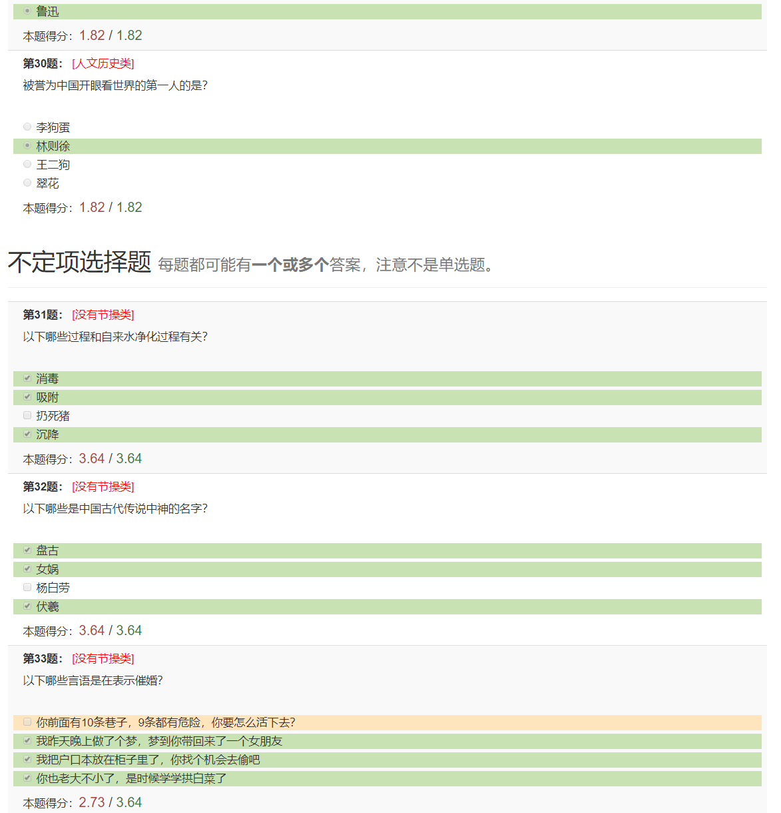
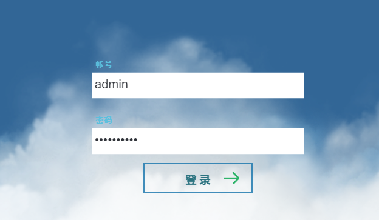
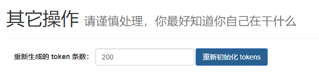
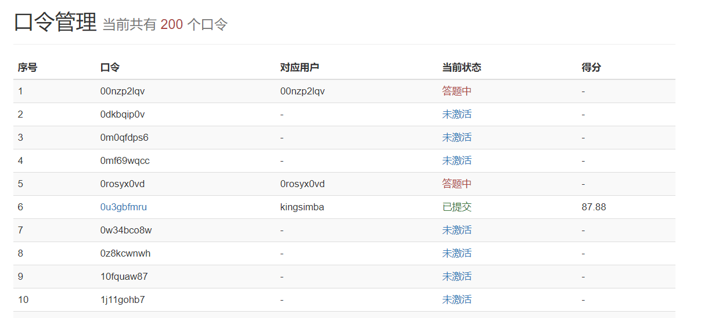
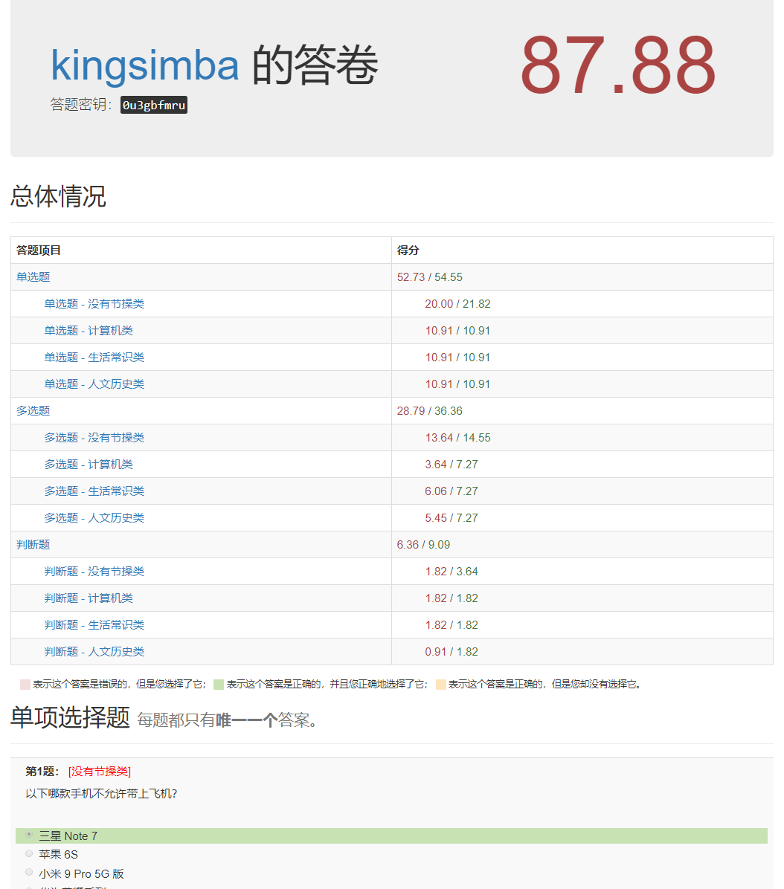
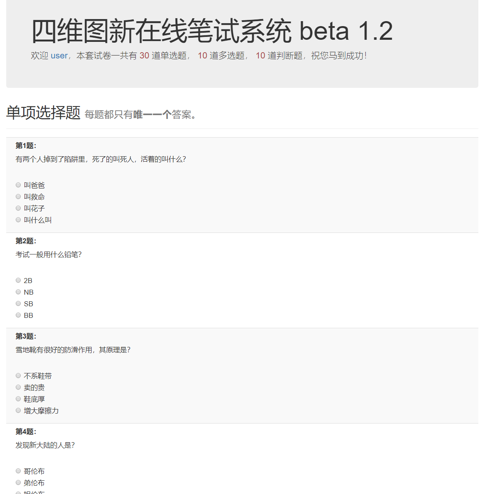

# 简易在线答题系统

## 简介

简易在线答题系统是一个可以在线答题的网站系统，可以用于简单的客观题竞赛或面试。



本项目使用 `MyEclipse` 环境开发，题库保存在 `WebRoot/questions.md` 文件中。
全项目不依赖数据库，只使用简单的 `JavaServlet` 实现所有功能，
适合初学者参考。

这个仓库中的题目只是样例，请替换成自己想要出的题目。

## 题库的格式

题库文件 `questions.md` 继承了基本的 `MarkDown` 的语法，支持比较常用的内联标记。
题库的整体语法格式类似于：

```
# 题目类别

## 单选题

题干内容：

* ( ) 选项1，不是正确答案
* (x) 选项2，是正确答案
* ( ) 选项3，不是正确答案
* ( ) 选项4，不是正确答案

...

## 多选题

题干内容：

* [x] 选项1，正确选项
* [ ] 选项2，不是正确选项
* [x] 选项3，正确选项
* [ ] 选项4，不是正确选项

...

## 判断题

* [ ] 答案为 false 的题目。
* [x] 答案为 true 的题目。

...
```

语法要点大致如下：

* 用一级标题的语法来表示一个类别的所有题目。
* 二级标题表示接下来的题目是什么类型的题目，目前只支持“单选题”，“多选题”，“判断题”。
* 题干部分支持 `MarkDown` 的以下语法：

  * 多行内容表示一个段落，用空行分隔多个段落；
  * 支持内联的 反引号，`*`，`**` 语法，分别会翻译成 `<code>`，`<em>`，`<strong>` 标签；
  * 支持插入图片，使用 `` 的语法格式；
  * 支持代码块，例如：

  ```
     ```cpp
     int main()
     {
      return 0;
     }
     ```
  ```

* 题干部分以遇到 `* ( )` 或 `* [ ]` 的标记结束，接下来的都将按照选项解析。
  选项支持内联语法，但是不支持多行。

题库的格式后续会逐渐完善。

## 系统用法

编译项目并生成 `war` 文件之后，部署到服务器上即可。

部署完成之后，访问根目录，会出现登录页面。



输入管理员账号即可登录管理后台。
目前管理员账号是硬代码写在程序里的，默认的管理员账号是 `admin`，密码是 `meiyoumima`。



进入后台之后，点击“重新初始化 tokens”按钮，将会重新生成一堆可以用来登录口令。
用户可以用这些口令登录到答题界面进行答题。

注意！重新初始化之后会覆盖掉原来已有的所有用户的答题记录。

口令是区分用户的唯一方式，请不要出现两个用户用同一个口令登录答题的情况。

在后台可以看到每个口令的使用情况。



如果用户已经提交答题结果，则可以通过单击口令上的超链接查看用户的答题详情。



答题用户在拿到答题口令的时候，就可以用口令当密码登录系统答题。用户名可以随便填写。
登录到系统之后，界面大致如图所示：



用户答完题之后，就可以提交答案了。提交之后，管理员就可以在后台看到这个用户的答题情况。

## 鸣谢

本项目的前端页面使用了以下开源项目，特此感谢：

* [Bootstrap](https://github.com/twbs/bootstrap)
* [FontAswome](https://github.com/FortAwesome/Font-Awesome)
* [Prism](https://github.com/PrismJS/prism)